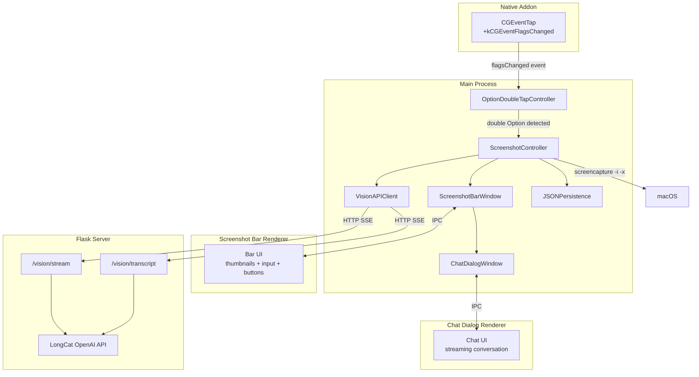

# Screenshot + Vision Feature Plan

## Requirements Summary

- Double-tap Option key triggers screenshot mode, independent from the existing double Cmd+C feature
- Floating horizontal bar displays image thumbnails + input area + action buttons
- Screenshot via macOS native `screencapture -i` (drag-to-select), max 9 images, each compressed to 1024px
- "+" button uploads files from disk (images, PDF, MD, TXT, JSON)
- Chat dialog: separate floating window above the bar for streaming AI conversation
- Transcript (Cmd+T): batch images+prompt to LLM, progress bar (3 phases), auto-copy to clipboard
- Persist all input/output to local JSON file
- LLM calls go through the Flask `agent_kernel/server.py` with new multimodal endpoints

## Architecture



## 1. Native Bridge: Add `kCGEventFlagsChanged` Support

**File:** [`native/cc_native_bridge/src/cc_native_bridge.mm`](native/cc_native_bridge/src/cc_native_bridge.mm)

Currently the CGEventTap only listens for `kCGEventKeyDown` (line 89). Option is a modifier key that generates `kCGEventFlagsChanged` events, not keyDown.

Changes:
- Add `kCGEventFlagsChanged` to the event mask: `CGEventMaskBit(kCGEventKeyDown) | CGEventMaskBit(kCGEventFlagsChanged)`
- In `EventTapCallback`, handle both event types:
  - For `kCGEventKeyDown`: existing behavior (emit keycode, flags, isCommand)
  - For `kCGEventFlagsChanged`: emit a new payload with `type: "flagsChanged"`, `flags`, and a boolean `isOptionOnly` (true when only Option flag is present, no other modifiers)
- Add an `eventType` field to `KeyEventPayload` so JS can distinguish keyDown from flagsChanged

**File:** [`src/main/native-bridge.ts`](src/main/native-bridge.ts)

- Extend `NativeKeyEvent` interface with `eventType?: 'keyDown' | 'flagsChanged'`
- In the `start()` callback, emit different events: `keydown` for keyDown, `flagschanged` for flagsChanged

## 2. Double-Option Detection Controller

**New file:** `src/main/option-doubletap-controller.ts`

A pure state machine (same pattern as [`src/main/hotkey-controller.ts`](src/main/hotkey-controller.ts)):

```typescript
export const DOUBLE_OPTION_THRESHOLD_MS = 400;
export const OPTION_DEBOUNCE_MS = 350;

export class OptionDoubleTapController {
  private lastOptionUpMs = -1;
  private lastTriggerMs = -1;

  handleFlagsChanged(flags: number, actions: { onTrigger: () => void }): void {
    const isOptionDown = (flags & (1 << 19)) !== 0;
    const hasOtherModifiers = (flags & ~(1 << 19)) & 0x1F0000;
    // Track Option key release (up) events for double-tap
    // Trigger on second release within threshold
  }
}
```

Key logic: detect Option key **release** (flagsChanged with Option flag gone), not press. Double-release within 400ms = trigger. Same debounce pattern as double Cmd+C (350ms).

## 3. Screenshot Controller (Main Process Orchestrator)

**New file:** `src/main/screenshot-controller.ts`

Central coordinator that:
- Listens for double-Option via `OptionDoubleTapController`
- Triggers macOS native `screencapture -i -x /tmp/cc-screenshot-{timestamp}.png` via `child_process.execFile`
- After capture completes, reads the image file, compresses to max 1024px using Electron `nativeImage`
- Manages the screenshot bar window and chat dialog window lifecycle
- Handles Cmd+T global hotkey for transcript
- Manages image state (up to 9 images stored as base64)
- Calls `VisionAPIClient` for LLM interactions
- Writes/reads JSON persistence files

Flow:
1. Double Option -> `screencapture -i -x` (bar is hidden during capture)
2. Capture done -> compress image -> show bar with thumbnail
3. User can: take more screenshots, upload files, chat, or transcript

## 4. Screenshot Bar Window

**New file:** `src/main/screenshot-bar-window.ts`

Manages a narrow floating `BrowserWindow` (~700x200, frameless, transparent background):
- Created lazily on first trigger
- Uses same overlay promotion pattern as [`src/main/window-controller.ts`](src/main/window-controller.ts)
- Positioned at bottom-center of current screen
- `alwaysOnTop: true`, `resizable: false`, `frame: false`

**New file:** `src/preload/screenshot-preload.ts`

Exposes `window.visionApi`:
- `onImagesUpdated(cb)` - receive image thumbnails
- `onTranscriptProgress(cb)` - progress bar updates
- `onChatResponse(cb)` - streaming chat chunks
- `requestScreenshot()` - trigger another screenshot
- `requestUploadFiles()` - open file picker
- `removeImage(index)` - remove an image
- `sendChat(text)` - send chat message (opens chat dialog)
- `requestTranscript(prompt?)` - start transcript
- `getImages()` - get current images

**New files for renderer:**
- `src/renderer/screenshot-bar/index.html`
- `src/renderer/screenshot-bar/bar.tsx` - React component
- `src/renderer/screenshot-bar/bar.css`

Bar UI layout (matching reference image):

```
+------------------------------------------------------------------+
| [img1 x] [img2 x] [img3 x]  ...  (horizontal scroll, max 9)    |
|------------------------------------------------------------------|
| [input text field, single line or auto-expand to ~3 lines]       |
|------------------------------------------------------------------|
| [+ Upload]  [Transcript]          [Screenshot btn]  [Send arrow] |
+------------------------------------------------------------------+
```

- Image thumbnails: small cards with close (x) button, horizontal scroll
- Input: text area for prompt, Enter to send (opens chat dialog)
- Buttons: "+" file upload, "Transcript" (or Cmd+T), screenshot camera icon, send arrow

## 5. Chat Dialog Window

**New file:** `src/main/chat-dialog-window.ts`

Separate `BrowserWindow` (~500x450), positioned directly above the screenshot bar:
- Frameless or minimal frame, floating
- Shows streaming conversation with the AI
- Receives images as context from the bar
- Can be closed to return to bar-only mode

**New files for renderer:**
- `src/renderer/chat-dialog/index.html`
- `src/renderer/chat-dialog/dialog.tsx` - React component with message list + streaming
- `src/renderer/chat-dialog/dialog.css`

## 6. Flask Server: Multimodal LLM Endpoints

**File:** [`agent_kernel/server.py`](agent_kernel/server.py)

Add OpenAI client for LongCat alongside the existing Anthropic client:

```python
from openai import OpenAI

longcat_api_key = os.getenv("LONGCAT_API_KEY")
longcat_base_url = os.getenv("LONGCAT_BASE_URL", "https://api.longcat.chat/openai")
longcat_model = os.getenv("LONGCAT_MODEL", "LongCat-Flash-Omni-2603")

vision_client = OpenAI(api_key=longcat_api_key, base_url=longcat_base_url)
```

New endpoints:

**`POST /vision/stream`** - Multimodal chat with streaming
- Input: `{ "message": "...", "images": [{ "data": "base64...", "mime": "image/png" }] }`
- Response: SSE stream (same format: `data: {"type":"chunk","content":"..."}`)
- Uses the message format from [`sample/longcat_omni_image.py`](sample/longcat_omni_image.py) (line 33-58) with `input_image` type

**`POST /vision/transcript`** - Batch image-to-text
- Input: `{ "images": [...], "prompt": "optional custom prompt" }`
- Response: SSE stream with additional `{"type":"phase","phase":"uploading|parsing|streaming"}` events
- Default prompt: "Please transcribe all text and content from these images into well-formatted Markdown."

## 7. Vision API Client (Main Process)

**New file:** `src/main/vision-api.ts`

Reuses the existing SSE streaming pattern from [`src/main/main.ts`](src/main/main.ts) (lines 439-506):
- `streamVisionChat(images, message, onChunk)` - calls `/vision/stream`
- `streamTranscript(images, prompt, onChunk)` - calls `/vision/transcript`
- Same SSE parsing logic as `streamAgentResponse`

## 8. JSON Persistence

**New file:** `src/main/screenshot-persistence.ts`

Stores session data at `{userData}/vision-sessions/{timestamp}.json`:

```typescript
interface VisionSession {
  id: string;
  createdAt: string;
  images: Array<{ filename: string; mimeType: string; base64: string }>;
  interactions: Array<{
    type: 'chat' | 'transcript';
    prompt: string;
    response: string;
    timestamp: string;
    status: 'success' | 'error';
  }>;
}
```

Write on every interaction (before LLM call: save input; after: append output).

## 9. Global Hotkey Registration

**File:** [`src/main/global-hotkey-manager.ts`](src/main/global-hotkey-manager.ts)

- Add listener for `flagschanged` event from native bridge (alongside existing `keydown`)
- Route flagsChanged events to `OptionDoubleTapController`
- Register `Cmd+T` shortcut for transcript (scope: when screenshot bar is visible)

## 10. Build Pipeline Updates

**File:** [`package.json`](package.json) scripts:
- `build:renderer` needs to also bundle `screenshot-bar/bar.tsx` and `chat-dialog/dialog.tsx` with esbuild
- Copy new HTML/CSS files to `dist/`

**File:** [`tsconfig.json`](tsconfig.json):
- Add `src/preload/screenshot-preload.ts` to includes (already covered by `src/preload/**/*.ts` glob)

## 11. Image Compression

Use Electron's built-in `nativeImage`:
```typescript
import { nativeImage } from 'electron';

function compressTo1024(imagePath: string): { base64: string; width: number; height: number } {
  let img = nativeImage.createFromPath(imagePath);
  const { width, height } = img.getSize();
  if (Math.max(width, height) > 1024) {
    const scale = 1024 / Math.max(width, height);
    img = img.resize({ width: Math.round(width * scale), height: Math.round(height * scale) });
  }
  return { base64: img.toPNG().toString('base64'), ...img.getSize() };
}
```

## Key Design Decisions

- **Screenshot via `screencapture -i -x`**: Uses macOS native region selection for reliability. The bar hides during capture to avoid self-capture. Custom overlay can be added later if needed.
- **Separate windows for bar and chat**: Per user preference. Bar stays narrow; chat floats above with its own window.
- **Flask routing**: Adds LongCat OpenAI client to existing server rather than calling API directly from Electron. This keeps API keys server-side and allows easy model switching.
- **nativeImage for compression**: No extra dependency needed; Electron built-in handles resize well.
- **Option key detection via flagsChanged**: The only way to detect modifier-only keypresses on macOS via CGEventTap.

## Files to Create (10 new files)

| File | Purpose |
|------|---------|
| `src/main/option-doubletap-controller.ts` | Double Option state machine |
| `src/main/screenshot-controller.ts` | Main orchestrator |
| `src/main/screenshot-bar-window.ts` | Bar BrowserWindow management |
| `src/main/chat-dialog-window.ts` | Chat dialog BrowserWindow management |
| `src/main/vision-api.ts` | HTTP client for /vision/* endpoints |
| `src/main/screenshot-persistence.ts` | JSON session persistence |
| `src/preload/screenshot-preload.ts` | contextBridge for vision windows |
| `src/renderer/screenshot-bar/index.html` + `bar.tsx` + `bar.css` | Bar UI |
| `src/renderer/chat-dialog/index.html` + `dialog.tsx` + `dialog.css` | Chat dialog UI |

## Files to Modify (5 files)

| File | Change |
|------|--------|
| `native/cc_native_bridge/src/cc_native_bridge.mm` | Add `kCGEventFlagsChanged` to event mask |
| `src/main/native-bridge.ts` | Emit `flagschanged` events |
| `src/main/global-hotkey-manager.ts` | Listen for flagsChanged, register Cmd+T |
| `src/main/main.ts` | Wire ScreenshotController, register new IPC channels |
| `agent_kernel/server.py` | Add `/vision/stream` and `/vision/transcript` endpoints |
