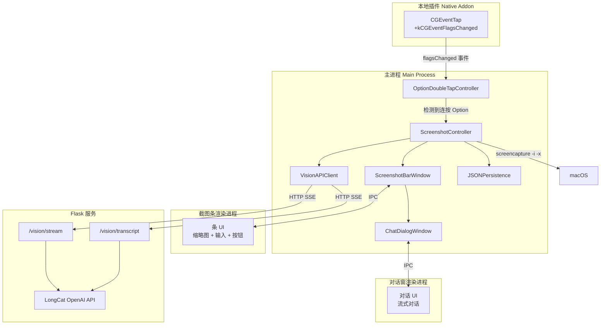

# 截图 + 视觉能力计划

## 需求摘要

- 连按 **Option** 进入截图模式，与现有连按 **Cmd+C** 能力相互独立
- 横向悬浮条：缩略图 + 输入区 + 操作按钮
- 截图通过 macOS 系统命令 `screencapture -i`（拖选区域），最多 9 张图，每张压缩到最长边 1024px
- 「+」按钮从本地上传（图片、PDF、MD、TXT、JSON）
- 对话：独立浮窗在条上方，与 AI 流式对话
- 转写（**Cmd+T**）：多图+提示词批量送 LLM，进度条分 3 阶段，完成后自动复制到剪贴板
- 所有输入/输出持久化到本地 JSON
- LLM 调用经 Flask `agent_kernel/server.py` 新增多模态端点

## 架构



## 1. 本地桥接：支持 `kCGEventFlagsChanged`

**文件：** [`native/cc_native_bridge/src/cc_native_bridge.mm`](native/cc_native_bridge/src/cc_native_bridge.mm)

当前 CGEventTap 仅监听 `kCGEventKeyDown`（约第 89 行）。**Option 是修饰键**，产生 `kCGEventFlagsChanged`，不会产生 keyDown。

改动要点：
- 将 `kCGEventFlagsChanged` 加入事件掩码：`CGEventMaskBit(kCGEventKeyDown) | CGEventMaskBit(kCGEventFlagsChanged)`
- 在 `EventTapCallback` 中同时处理两类事件：
  - `kCGEventKeyDown`：保持现有行为（发出 keycode、flags、isCommand）
  - `kCGEventFlagsChanged`：发出新载荷，含 `type: "flagsChanged"`、`flags`，以及布尔 `isOptionOnly`（仅 Option 按下、无其他修饰键时为 true）
- 在 `KeyEventPayload` 中增加 `eventType`，供 JS 区分 keyDown 与 flagsChanged

**文件：** [`src/main/native-bridge.ts`](src/main/native-bridge.ts)

- 扩展 `NativeKeyEvent`：`eventType?: 'keyDown' | 'flagsChanged'`
- 在 `start()` 回调中分别发出事件：keyDown 用 `keydown`，flagsChanged 用 `flagschanged`

## 2. 连按 Option 检测控制器

**新文件：** `src/main/option-doubletap-controller.ts`

纯状态机（与 [`src/main/hotkey-controller.ts`](src/main/hotkey-controller.ts) 同构）：

```typescript
export const DOUBLE_OPTION_THRESHOLD_MS = 400;
export const OPTION_DEBOUNCE_MS = 350;

export class OptionDoubleTapController {
  private lastOptionUpMs = -1;
  private lastTriggerMs = -1;

  handleFlagsChanged(flags: number, actions: { onTrigger: () => void }): void {
    const isOptionDown = (flags & (1 << 19)) !== 0;
    const hasOtherModifiers = (flags & ~(1 << 19)) & 0x1F0000;
    // 跟踪 Option 松开（up）的 flagsChanged
    // 在阈值内第二次松开时触发
  }
}
```

核心逻辑：检测 **Option 松开**（flagsChanged 且 Option 位消失），而非按下。400ms 内 **第二次松开** 即触发。去抖与连按 Cmd+C 一致（350ms）。

## 3. 截图控制器（主进程编排）

**新文件：** `src/main/screenshot-controller.ts`

中央协调，负责：
- 通过 `OptionDoubleTapController` 监听连按 Option
- 用 `child_process.execFile` 调用系统 `screencapture -i -x /tmp/cc-screenshot-{timestamp}.png`
- 完成后读图，用 Electron `nativeImage` 压到最长边 1024px
- 管理截图条窗体与对话窗生命周期
- 处理 Cmd+T 全局转写热键
- 管理图片状态（最多 9 张，存为 base64）
- 通过 `VisionAPIClient` 调用 LLM
- 读写 JSON 持久化

流程：
1. 连按 Option → `screencapture -i -x`（截屏时隐藏条，避免自截）
2. 截完 → 压缩 → 显示条与缩略图
3. 用户可：继续截屏、上传、对话、或转写

## 4. 截图条窗口

**新文件：** `src/main/screenshot-bar-window.ts`

管理窄条浮窗 `BrowserWindow`（约 700×200，无框、透明背景）：
- 首次触发时懒创建
- 覆盖层提升与 [`src/main/window-controller.ts`](src/main/window-controller.ts) 相同
- 位于当前屏底部居中
- `alwaysOnTop: true`，`resizable: false`，`frame: false`

**新文件：** `src/preload/screenshot-preload.ts`

向 `window.visionApi` 暴露：
- `onImagesUpdated(cb)` — 缩略图更新
- `onTranscriptProgress(cb)` — 转写进度
- `onChatResponse(cb)` — 流式对话片段
- `requestScreenshot()` — 再截一屏
- `requestUploadFiles()` — 打开文件选择
- `removeImage(index)` — 删某张图
- `sendChat(text)` — 发消息（打开对话窗）
- `requestTranscript(prompt?)` — 开始转写
- `getImages()` — 当前图片列表

**渲染端新文件：**
- `src/renderer/screenshot-bar/index.html`
- `src/renderer/screenshot-bar/bar.tsx`
- `src/renderer/screenshot-bar/bar.css`

条 UI 布局（与参考图一致）：

```
+------------------------------------------------------------------+
| [图1 x] [图2 x] [图3 x]  ...  （横向滚动，最多 9 张）            |
|------------------------------------------------------------------|
| [单行输入或可自动扩到约 3 行]                                    |
|------------------------------------------------------------------|
| [+ 上传]  [转写]          [截屏]  [发送]                         |
+------------------------------------------------------------------+
```

- 缩略图：小卡片 + 关闭 (x)，横向滚动
- 输入区：提示词，Enter 发送（打开对话窗）
- 按钮：「+」上传、「转写」（或 Cmd+T）、截屏、发送

## 5. 对话浮窗

**新文件：** `src/main/chat-dialog-window.ts`

独立 `BrowserWindow`（约 500×450），位于截图条正上方：
- 无框或极简框、浮动
- 与 AI 流式对话
- 从条接收图片作为上下文
- 关闭后回到仅条模式

**渲染端新文件：**
- `src/renderer/chat-dialog/index.html`
- `src/renderer/chat-dialog/dialog.tsx`（消息列表 + 流式）
- `src/renderer/chat-dialog/dialog.css`

## 6. Flask 服务：多模态 LLM 端点

**文件：** [`agent_kernel/server.py`](agent_kernel/server.py)

在现有 Anthropic 客户端旁增加 LongCat 的 OpenAI 客户端：

```python
from openai import OpenAI

longcat_api_key = os.getenv("LONGCAT_API_KEY")
longcat_base_url = os.getenv("LONGCAT_BASE_URL", "https://api.longcat.chat/openai")
longcat_model = os.getenv("LONGCAT_MODEL", "LongCat-Flash-Omni-2603")

vision_client = OpenAI(api_key=longcat_api_key, base_url=longcat_base_url)
```

新端点：

**`POST /vision/stream`** — 多模态对话 + 流式
- 入参：`{ "message": "...", "images": [{ "data": "base64...", "mime": "image/png" }] }`
- 出参：SSE（格式同前：`data: {"type":"chunk","content":"..."}`）
- 消息格式见 [`sample/longcat_omni_image.py`](sample/longcat_omni_image.py) 第 33–58 行，`input_image` 类型

**`POST /vision/transcript`** — 批量图转文
- 入参：`{ "images": [...], "prompt": "可选自定义提示" }`
- 出参：SSE，并含 `{"type":"phase","phase":"uploading|parsing|streaming"}` 阶段事件
- 默认提示：「请将这些图片中的全部文字与内容转写为结构良好的 Markdown。」

## 7. Vision API 客户端（主进程）

**新文件：** `src/main/vision-api.ts`

复用 [`src/main/main.ts`](src/main/main.ts) 中已有 SSE 流式模式（约第 439–506 行）：
- `streamVisionChat(images, message, onChunk)` → `/vision/stream`
- `streamTranscript(images, prompt, onChunk)` → `/vision/transcript`
- SSE 解析与 `streamAgentResponse` 一致

## 8. JSON 持久化

**新文件：** `src/main/screenshot-persistence.ts`

会话文件路径：`{userData}/vision-sessions/{timestamp}.json`：

```typescript
interface VisionSession {
  id: string;
  createdAt: string;
  images: Array<{ filename: string; mimeType: string; base64: string }>;
  interactions: Array<{
    type: 'chat' | 'transcript';
    prompt: string;
    response: string;
    timestamp: string;
    status: 'success' | 'error';
  }>;
}
```

每次交互落盘：LLM 调用**前**保存输入，**后**追加输出。

## 9. 全局热键注册

**文件：** [`src/main/global-hotkey-manager.ts`](src/main/global-hotkey-manager.ts)

- 在现有 `keydown` 之外，监听桥接的 `flagschanged`
- 将 flagsChanged 交给 `OptionDoubleTapController`
- 注册 `Cmd+T` 转写（仅在截图条可见时生效）

## 10. 构建管线

**文件：** [`package.json`](package.json) 脚本：
- `build:renderer` 需用 esbuild 同时打包 `screenshot-bar/bar.tsx` 与 `chat-dialog/dialog.tsx`
- 将新 HTML/CSS 复制到 `dist/`

**文件：** [`tsconfig.json`](tsconfig.json)：
- `src/preload/screenshot-preload.ts` 已可由 `src/preload/**/*.ts` 覆盖，一般无需单加

## 11. 图片压缩

使用 Electron 内置 `nativeImage`：

```typescript
import { nativeImage } from 'electron';

function compressTo1024(imagePath: string): { base64: string; width: number; height: number } {
  let img = nativeImage.createFromPath(imagePath);
  const { width, height } = img.getSize();
  if (Math.max(width, height) > 1024) {
    const scale = 1024 / Math.max(width, height);
    img = img.resize({ width: Math.round(width * scale), height: Math.round(height * scale) });
  }
  return { base64: img.toPNG().toString('base64'), ...img.getSize() };
}
```

## 关键设计决策

- **用 `screencapture -i -x` 截屏**：系统原生框选，稳定；截屏时隐藏条避免自截。若需自定义遮罩可后续加。
- **条与对话分窗**：按产品偏好，条保持窄条，对话独立浮在上方。
- **经 Flask 转发 LongCat**：在现有服务上加客户端，避免 Electron 直持密钥，便于换模型。
- **nativeImage 压缩**：无额外依赖，Electron 内建缩放足够。
- **Option 用 flagsChanged**：在 macOS 上通过 CGEventTap 只能这样可靠地捕获「仅修饰键」行为。

## 需新建文件（10 个）

| 文件 | 用途 |
|------|------|
| `src/main/option-doubletap-controller.ts` | 连按 Option 状态机 |
| `src/main/screenshot-controller.ts` | 主流程编排 |
| `src/main/screenshot-bar-window.ts` | 条窗口 BrowserWindow |
| `src/main/chat-dialog-window.ts` | 对话窗 BrowserWindow |
| `src/main/vision-api.ts` | 调用 /vision/* 的 HTTP 客户端 |
| `src/main/screenshot-persistence.ts` | JSON 会话持久化 |
| `src/preload/screenshot-preload.ts` | 视觉相关窗口的 contextBridge |
| `src/renderer/screenshot-bar/index.html` + `bar.tsx` + `bar.css` | 条 UI |
| `src/renderer/chat-dialog/index.html` + `dialog.tsx` + `dialog.css` | 对话 UI |

## 需修改文件（5 个）

| 文件 | 变更 |
|------|------|
| `native/cc_native_bridge/src/cc_native_bridge.mm` | 事件掩码增加 `kCGEventFlagsChanged` |
| `src/main/native-bridge.ts` | 发出 `flagschanged` 事件 |
| `src/main/global-hotkey-manager.ts` | 监听 flagsChanged，注册 Cmd+T |
| `src/main/main.ts` | 接入 ScreenshotController、注册 IPC |
| `agent_kernel/server.py` | 增加 `/vision/stream` 与 `/vision/transcript` |
